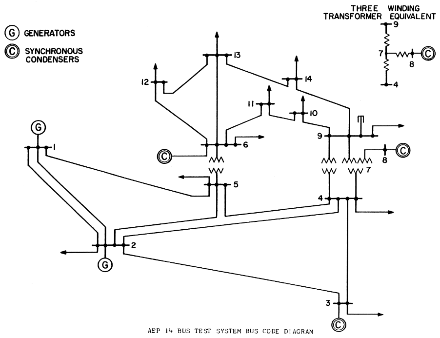

# Newton-Rhapson-Power-Flow
Implementation of Newton Rhapson Power Flow (NRPF) algorithm on IEEE-14 bus system with transformer taps, Q-limits, and Fast Decoupled power flow approach for better computation. The program is developed without using **any** in-built functions of ```MATLAB```. Although presented for the IEEE-14 bus system, the code is generalized to work for different system provided that the data is presented in IEEE common data format.  



# Assumptions
1. In order to make this work, we have to assume that Bus 1 is the slack bus. Hence, bus 1 is always considered as a slack bus.
2. The Crout's LU factorization algorithm does not work when the first diagonal element of L is zero.

# Development Stages
1. Reading bus and branch data in common data format 
1. Y-bus formulation
2. Calculating Jacobian Matrix
3. Inversion using Crout's LU factorization 
4. Solving NRPF unless *power mismatch* < 0.001
5. Fast Decoupled Power Flow
  * when the B matrices are same for both the diagonal sub-Jacobian matrices
  * when the B matrices are different for the diagonal sub-Jacobian matrices i.e. when lossless system is assumed (i.e. B = 1/X).
6. Implementing Q-lim controls
 

# Dependencies
1. ```MATLAB```
Although any version would work, I wrote it in 2020a. Please let me know if the script does not run on your system. I can provide a version compatible script on request.
